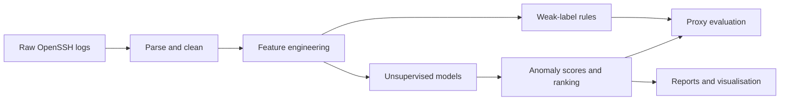

# OpenSSH Log Anomaly Detection
Machine learning pipeline for detecting unusual behaviour in **OpenSSH logs** using **temporal featurThis project is designed as a portfolio-ready example of:
- log parsing and feature engineering
- anomaly detection on sequential security data
- evaluation under limited labels
- lightweight MLOps and reproducible experimentation
- technical communication for security and ML workflows
---
## Project Overview
This repository explores how to detect potentially suspicious SSH activity from system logs when reliThe goal is not to build a production SOC system, but to demonstrate an end-to-end ML pipeline for se---
## Motivation
SSH services are common targets for brute-force activity, unusual login behaviour, and credential misThis project focuses on that scenario: learning from OpenSSH logs without depending on fully supervis---
## What This Project Does
- parses and cleans raw OpenSSH logs
- builds structured features from time patterns, templates, and event behaviour
- trains unsupervised anomaly detection models
- creates weak labels with heuristic rules for proxy evaluation
- ranks suspicious events or sessions
- produces reproducible outputs and reports for analysis
---
## Key Features
- **Temporal feature engineering** from raw OpenSSH log events
- **Unsupervised models**:
 - Isolation Forest
 - Local Outlier Factor (LOF)
 - One-Class SVM
- **Weak supervision** for evaluation when true labels are limited
- **Proxy metrics** such as PR-AUC and Recall@K
- **Config-driven pipeline** using YAML
- **CLI-based workflow** for prepare / train / eval
- **Testing and lightweight CI support**
- **Portfolio-friendly structure** with docs, configs, notebooks and reproducible steps
---
## Technical Stack
- Python
- pandas / numpy
- scikit-learn
- YAML configuration
- pytest
- Jupyter notebooks
- Docker
- GitHub Actions
---
## End-to-End Workflow

---
## Repository Structure
```text
openssh-anomaly/
■■ docs/ # model_card, system_design, labeling_strategy, security
■■ data/{raw,interim,processed}
■■ notebooks/ # 00_pipeline.ipynb (demo)
■■ src/openssh_anomaly/ # Python package (pipeline and CLI)
■■ tests/ # pytest tests (parser, features, pipeline)
■■ configs/ # YAML configs
■■ docker/ # Dockerfile
■■ .github/workflows/ # CI (lint + tests)
■■ Makefile, requirements.txt, README.md
```
---
## Quickstart
```bash
# 1) Create environment
python -m venv .venv && source .venv/bin/activate
pip install -r requirements.txt
# 2) Add data (OpenSSH from Loghub)
# Clone or copy the files from:
# https://github.com/logpai/loghub/tree/master/OpenSSH
# into data/raw/
# 3) Run the minimum pipeline
python -m openssh_anomaly.cli prepare --config configs/base.yaml
python -m openssh_anomaly.cli train --config configs/base.yaml
python -m openssh_anomaly.cli eval --config configs/base.yaml
```
**Expected flow:**
- `prepare` parses logs and creates structured features
- `train` fits anomaly detection models
- `eval` computes proxy metrics and produces ranked outputs
> **Note:** This repository does not include the raw dataset because of source/licensing and size con---
## Methodology
### 1. Data preparation
The pipeline starts from raw OpenSSH logs and converts them into structured records that can be used ### 2. Feature engineering
The project builds time-aware and event-aware features from the logs, including:
- event frequency over windows
- template-based behaviour
- suspicious flags and patterns
- contextual indicators useful for anomaly scoring
### 3. Modelling
The main modelling approach is unsupervised anomaly detection, using:
- Isolation Forest
- Local Outlier Factor
- One-Class SVM
This is appropriate because real attack labels are often incomplete or unavailable in log-based secur### 4. Weak supervision
To evaluate the models in a practical way, the project uses heuristic weak labels. These are not trea### 5. Evaluation
The project focuses on practical metrics such as:
- **PR-AUC (proxy)**
- **Recall@K**
- operational alert prioritisation
This is more useful than accuracy in a highly imbalanced anomaly-detection setting.
---
## Results and Outputs
The main outputs of the pipeline are:
- processed feature datasets
- trained anomaly detection models
- anomaly scores and ranked events
- proxy evaluation metrics
- supporting documentation and visual analysis
If you have specific result files, notebooks, screenshots, or example rankings, this section can be e- one short metrics table
- one example output screenshot
- one brief interpretation of what “good” looks like in this workflow
---
## Why Weak Supervision Was Used
A key challenge in security log analysis is that high-quality labels are often missing, noisy, or expThis makes the pipeline more realistic for real-world log analytics, while still allowing structured ---
## What This Project Demonstrates
For ML / data roles:
- feature engineering from messy semi-structured data
- unsupervised learning workflow
- reproducible experiment design
- evaluation under imperfect labels
For security-oriented roles:
- practical handling of authentication logs
- anomaly-detection framing for security monitoring
- alert ranking mindset
- awareness of PII and operational constraints
---
## Limitations
- Weak labels are noisy and are only a proxy for real attack labels
- Unsupervised anomaly detection can produce false positives
- Model quality depends heavily on feature design and log quality
- This project is a strong prototype / portfolio pipeline, not a production SOC deployment
---
## Future Improvements
- stronger hyperparameter tuning for LOF and One-Class SVM
- temporal backtesting across different periods
- richer explainability for ranked anomalies
- lightweight dashboard for analyst review
- stronger benchmarking against rule-based baselines
---
## Security / Data Notes
- The project avoids unnecessary exposure of sensitive information
- Public examples should minimise or hash IP / user identifiers where needed
- Raw logs are not bundled with the repository
---
## References / Data Source
- **Dataset:** Loghub OpenSSH
 https://github.com/logpai/loghub/tree/master/OpenSSH
- **Related tooling and methodology:**
 scikit-learn documentation and anomaly detection literature
---
## Portfolio Note
This repository is intended as a portfolio project that demonstrates practical ML engineering on security log data. It focuses on clear structure, reproducibility, and realistic evaluation choices rather than exaggerated claims.
