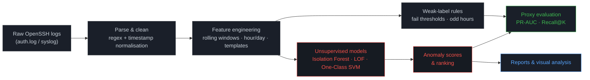
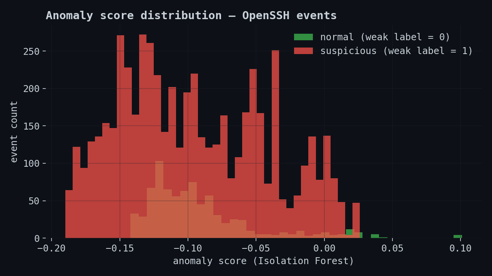
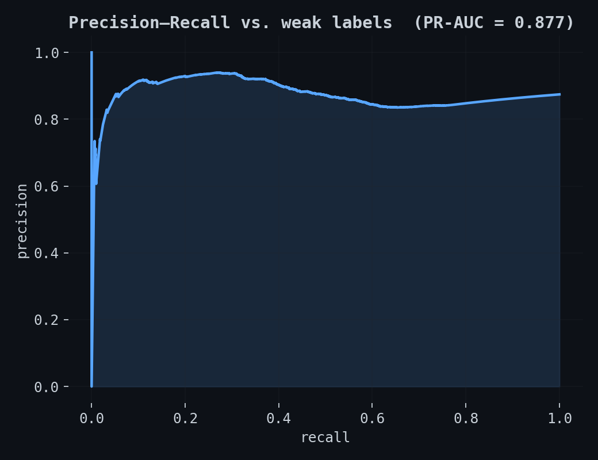
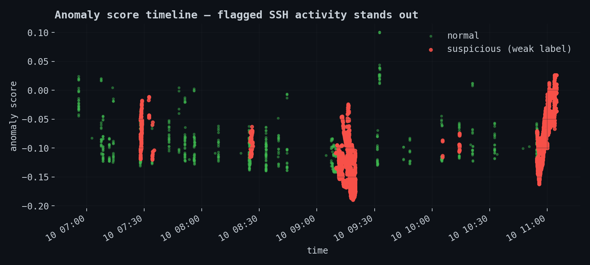

<div align="center">

# 🛡️ OpenSSH Log Anomaly Detection

**Unsupervised machine learning for spotting suspicious SSH activity — without a single labeled attack.**

[](https://www.python.org/)
[](https://scikit-learn.org/)
[](https://pandas.pydata.org/)
[](docker/Dockerfile)
[](.github/workflows/ci.yml)
[](tests/)

</div>

```
$ tail -f /var/log/auth.log | openssh-anomaly score --live

[07:07:38] sshd[24206] Failed password for invalid user test9 from 52.80.34.196   score=-0.02  ░░░░
[09:24:11] sshd[27841] Failed password for invalid user admin from 173.234.31.186 score= 0.06  ▓▓▓▓▓▓  ⚠ flagged
[11:02:55] sshd[30112] Accepted password for deploy from 10.0.0.4                 score=-0.15  ░░░░
```

A **CLI-driven ML pipeline** that parses raw OpenSSH logs, engineers temporal/behavioural features, and ranks events by *how anomalous they look* — using models that never saw a single confirmed attack during training. Built to answer a very real security-engineering problem: **most logs have no attack labels.**

---

## Why this exists

SSH is one of the most attacked services on the public internet — brute force, credential stuffing, invalid-user probing, all day, every day. In a real environment, nobody hands you a clean CSV of "these 40 lines were attacks." You have raw `auth.log`, a lot of noise, and no ground truth.

This project treats that constraint as the actual problem to solve, not something to work around with a toy labeled dataset:

- **No supervised shortcut.** Models (Isolation Forest, Local Outlier Factor, One-Class SVM) are trained purely on the shape of "normal" behaviour — they never see a target column.
- **Weak supervision for evaluation, not training.** Simple heuristic rules (repeated failures in a time window, logins at unusual hours) generate *proxy* labels used only to sanity-check the ranking — never fed to the model.
- **Ranking over classification.** The deliverable isn't "attack / not attack," it's a ranked list an analyst can triage top-down, which is how alert queues actually get worked.

---

## How it works



Four CLI stages map directly onto this diagram — `prepare → train → predict → eval` — each one a single command, each one testable in isolation (see `tests/`).

---

## Results — on real (public) data

These plots come from actually running the pipeline end-to-end on the [Loghub OpenSSH](https://github.com/logpai/loghub/tree/master/OpenSSH) public sample (a real honeypot server's `auth.log`, 2k lines) — not mocked numbers. Regenerate them yourself with `python scripts/generate_plots.py` after running the pipeline.

<table>
<tr>
<td width="50%">

**Score distribution**


</td>
<td width="50%">

**Precision–Recall vs. weak labels**


</td>
</tr>
</table>



> **Reading these honestly:** the public sample is a honeypot log, so the large majority of traffic is *already* malicious — that inflates PR-AUC (0.877) and depresses `Recall@200` (0.029), since 200 is a small slice of ~5.5k weak-positives. On a normal production server, where attacks are the rare minority, both numbers behave very differently — which is exactly why the pipeline reports **proxy metrics and rankings**, not a single accuracy figure. Full discussion in [`docs/model_card.md`](docs/model_card.md).

---

## What's technically interesting here

- **Temporal + behavioural feature engineering** — rolling per-host windows (`fails_w`, `accepts_w`, `msgsum_w`) turn a stream of log lines into time-aware signals a model can actually use.
- **Three unsupervised models compared on the same features** — Isolation Forest, LOF, One-Class SVM each have different assumptions about what "normal" looks like; the config makes swapping between them a one-line change (`configs/base.yaml`).
- **Weak supervision as an evaluation contract, not a crutch** — the rules in [`src/openssh_anomaly/rules.py`](src/openssh_anomaly/rules.py) are intentionally simple and auditable, and are wired only into `eval`, never into `train`.
- **Config-driven, tested, containerised** — YAML config, `pytest` coverage on parser/features/pipeline, a `Dockerfile`, and CI on GitHub Actions. Small pipeline, production-shaped habits.

---

## Quickstart

```bash
# 1) Environment
python -m venv .venv && source .venv/bin/activate
pip install -r requirements.txt

# 2) Data — grab the public OpenSSH sample (or drop your own auth.log here)
curl -s https://raw.githubusercontent.com/logpai/loghub/master/OpenSSH/OpenSSH_2k.log \
  -o data/raw/OpenSSH_2k.log

# 3) Run the pipeline
export PYTHONPATH=src
python -m openssh_anomaly.cli prepare --config configs/base.yaml
python -m openssh_anomaly.cli train   --config configs/base.yaml
python -m openssh_anomaly.cli predict --config configs/base.yaml
python -m openssh_anomaly.cli eval    --config configs/base.yaml
```

Or with `make`: `make setup && make demo` runs `prepare → train → eval` in one shot.

**With Docker:**

```bash
docker build -t openssh-anomaly -f docker/Dockerfile .
docker run --rm -v $(pwd)/data:/app/data openssh-anomaly
```

```text
Features preparadas → data/processed/openssh_features.parquet (6330 filas)
Modelo entrenado     → data/processed/detector.pkl
Scores escritos      → data/processed/openssh_scored.parquet
PR-AUC (proxy): 0.8766
Recall@200: 0.0294
```

Run the tests: `pytest -q` · Lint: `make lint`

---

## Project structure

```text
openssh-anomaly/
├── src/openssh_anomaly/   Python package — parser, features, models, CLI
├── configs/                YAML configs (model choice, windows, thresholds)
├── notebooks/               00_pipeline.ipynb — runnable end-to-end demo
├── scripts/                 generate_plots.py — reproduces the charts above
├── tests/                   pytest — parser, features, pipeline
├── docs/                    model card, system design, labeling & security notes
├── docker/                  Dockerfile
└── .github/workflows/       CI (lint + tests)
```

---

## 📚 Documentation

Depth lives in `docs/`, not in this README — each file is short and scoped:

| Doc | What's in it |
|---|---|
| [`model_card.md`](docs/model_card.md) | Intended use, data source, evaluation metric, known risks |
| [`system_design.md`](docs/system_design.md) | Architecture diagram and the design decisions behind it |
| [`labeling_strategy.md`](docs/labeling_strategy.md) | The exact weak-label heuristics used for evaluation |
| [`security_considerations.md`](docs/security_considerations.md) | PII handling, anonymisation, what never ships in the repo |

---

## Limitations (said plainly)

- Weak labels are a noisy **proxy** for real attacks, not ground truth.
- Unsupervised detectors will produce false positives — this is a triage/ranking aid, not an auto-blocker.
- Model quality is bottlenecked by feature design more than by algorithm choice.
- This is a portfolio-grade prototype, not a hardened SOC deployment — see [`docs/security_considerations.md`](docs/security_considerations.md) for what that means in practice.

---

<div align="center">

Built by **[@adro0303](https://github.com/adro0303)** — Software / AI development, one real dataset at a time.
More projects: [github.com/adro0303](https://github.com/adro0303)

</div>
